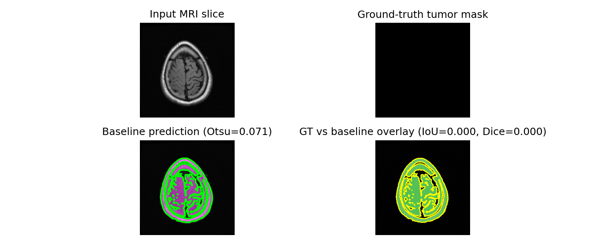
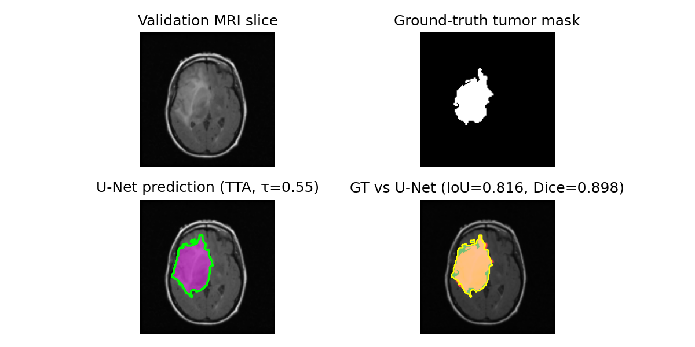

# Aplicación de Deep Learning en Salud: Segmentación de Tumores Cerebrales en MRI

> De los baselines clásicos al Deep Learning en MRI
>
> **Diego Olguín — dolguin@cmm.uchile.cl**
>
> Charla práctica que cubre datos, modelos, entrenamiento, evaluación y AI responsable.

## Objetivos de aprendizaje

Los objetivos de esta charla son…

1. **Cargar y explorar** datos de MRI cerebrales; entender emparejamiento imagen–máscara
2. **Construir un baseline clásico** (umbral de Otsu) y entender por qué falla
3. **Diseñar y entrenar** un U-Net con bloques residuales, atención SE y EMA
4. **Evaluar rigurosamente** — métricas por slice, agregación por paciente, análisis de fallos
5. **Discutir limitaciones** y uso responsable de AI en imagen médica

> ⚠️ Esto es un **prototipo educativo** — NO es un dispositivo clínico. Las salidas nunca deben usarse para diagnóstico.

---

## Material de esta charla

Todo el código y los datos de ejemplo están en GitHub — puedes clonar el repositorio y ejecutar los notebooks tú mismo.

**Repositorio**

https://github.com/diegoolguinw/brain_mri_analyzer

**Escanea el QR**


---

## Hoja de ruta de la charla

0 · Primeros pasos → 1 · Datos → 2 · Baseline → 3 · Teoría → 4 · Modelo → 5 · Entrenamiento → 6 · Evaluación → 7 · Ética

| # | Sección               | Pregunta clave                                              |
|---|-----------------------|-------------------------------------------------------------|
| 0 | Primeros pasos        | ¿Qué son redes neuronales, convoluciones y segmentación?     |
| 1 | Datos y contexto       | ¿Cómo se ve un MRI cerebral?                                 |
| 2 | Baseline             | ¿Hasta dónde puede llegar un método simple?                 |
| 3 | Teoría               | ¿Cómo funciona y por qué el U-Net?                         |
| 4 | Modelo               | ¿Cómo lo implementamos en PyTorch?                         |
| 5 | Entrenamiento        | ¿Cómo manejamos el desbalance de clases?                   |
| 6 | Evaluación           | ¿Cómo sabemos si el modelo es suficientemente bueno?       |
| 7 | AI responsable       | ¿Es seguro desplegar este modelo?                          |

---

# 00 — Primeros pasos

## ¿Qué es MRI?

**Resonancia Magnética (MRI)** usa campos magnéticos fuertes y ondas de radio para crear imágenes detalladas de órganos y tejidos — *sin radiación*.

| Propiedad     | Detalles                                                                 |
|--------------|--------------------------------------------------------------------------|
| Cómo funciona| Los átomos de hidrógeno en el agua se alinean con el imán y emiten señales de radio cuando se pulsan |
| Resolución    | Sub-milimétrica — puede ver estructuras finas del cerebro                |
| Contraste     | Diferentes tejidos aparecen como distintos tonos de gris                 |
| Slices        | El cerebro se imagina en secciones 2D llamadas **slices**                 |

> **Clave para nosotros:** Una slice de MRI es simplemente una **imagen en escala de grises** donde cada píxel codifica tipo de tejido. Más brillante = más contenido de agua (los tumores suelen verse brillantes).

**Planos de visualización:**

- **Axial** — vista de arriba hacia abajo (nuestro dataset usa esta)
- **Sagital** — vista lateral
- **Coronal** — vista frontal

---

## ¿Qué es un glioma?

Un **glioma** es un tipo de tumor cerebral que surge de las *células gliales*, las células de soporte del sistema nervioso.

| Grado  | Nombre                          | Comportamiento                            |
|--------|---------------------------------|--------------------------------------------|
| I–II   | **Bajo grado** (LGG) ← nuestro dataset | Crecimiento lento, mejor pronóstico      |
| III    | Anaplásico                      | Agresividad intermedia                     |
| IV     | Glioblastoma (GBM)              | Muy agresivo, peor pronóstico              |

> 💡 Nuestro dataset consiste en **Gliomas de Bajo Grado** — tienden a tener límites bien definidos, lo que los hace un buen punto de partida para segmentación.

### Por qué importa la segmentación

- **Diagnóstico:** medir tamaño y ubicación del tumor
- **Planificación quirúrgica:** definir márgenes seguros de resección
- **Radioterapia:** dirigir la radiación con precisión
- **Monitoreo:** seguir el crecimiento en el tiempo (p. ej., cada 6 meses)

> La segmentación manual por un radiólogo puede tomar **15–30 minutos por examen** — la automatización podría ahorrar tiempo clínico importante.

---

## Tareas de visión por computador — ¿dónde encaja la segmentación?

| Tarea                    | Pregunta                       | Salida                              | Ejemplo                                         |
|--------------------------|-------------------------------|-------------------------------------|-------------------------------------------------|
| **Clasificación**        | "¿Qué hay en esta imagen?"    | Etiqueta única                      | "Esta es una MRI cerebral"                    |
| **Detección de objetos** | "¿Dónde están los objetos?"   | Cajas delimitadoras + etiquetas      | Un rectángulo alrededor del tumor               |
| **Segmentación semántica** | "¿Qué es cada píxel?"       | Mapa de etiquetas por píxel         | Cada píxel → tumor o sano ← **nuestra tarea**  |
| **Segmentación de instancias** | "¿A qué objeto pertenece cada píxel?" | Etiqueta por píxel + ID de instancia | Máscara separada para tumor A vs tumor B       |

> 🎯 **Segmentación semántica** es la tarea más común en imagen médica — necesitamos fronteras precisas a nivel de píxel, no solo cajas.

---

## ¿Qué es una red neuronal?

Una red neuronal es una función que **aprende de los datos** ajustando pesos internos.

```
Input → [Layer 1] → [Layer 2] → ... → [Layer N] → Output
           ↑            ↑                  ↑
        weights      weights            weights
        (learned)    (learned)          (learned)
```

### Vocabulario clave

| Término       | Significado                                                                 |
|--------------|-----------------------------------------------------------------------------|
| **Peso**      | Un número aprendible que escala señales de entrada                          |
| **Activación**| Función no lineal (p. ej., ReLU) que permite aprender patrones complejos     |
| **Capa**      | Conjunto de operaciones aplicadas a los datos (p. ej., convolución + activación) |
| **Parámetro** | Cualquier valor aprendible — nuestro modelo tiene ~17.5M de ellos             |

### Cómo aprende

1. **Forward pass:** la entrada recorre las capas → predicción
2. **Pérdida:** comparar predicción con la ground-truth → puntuación de error
3. **Backward pass (backprop):** calcular cómo cada peso contribuyó al error
4. **Actualización:** ajustar pesos para reducir el error (descenso por gradiente)

> 💡 Repetir esto millones de veces sobre muchas imágenes → la red aprende a reconocer patrones (como tumores en MRI).

---

## ¿Qué es una convolución?

Una **convolución** desliza un filtro pequeño (kernel) sobre la imagen, produciendo un **mapa de características** que resalta ciertos patrones.

```
Image (5×5)         Kernel (3×3)       Feature Map (3×3)

┌─┬─┬─┬─┬─┐       ┌───┬───┬───┐      ┌───┬───┬───┐
│1│0│1│0│1│       │-1 │ 0 │ 1 │      │   │   │   │
├─┼─┼─┼─┼─┤       ├───┼───┼───┤      │   │   │   │
│0│1│0│1│0│  ✱    │-1 │ 0 │ 1 │  →   │ . │ . │ . │
├─┼─┼─┼─┼─┤       ├───┼───┼───┤      │   │   │   │
│1│0│1│0│1│       │-1 │ 0 │ 1 │      └───┴───┴───┘
├─┼─┼─┼─┼─┤       └───┴───┴───┘
│0│1│0│1│0│
├─┼─┼─┼─┼─┤
│1│0│1│0│1│
└─┴─┴─┴─┴─┘
```

### ¿Por qué convoluciones para imágenes?

- **Patrones locales:** un kernel 3×3 observa un vecindario pequeño — útil para bordes y texturas
- **Invarianza a la traslación:** el mismo filtro aplicado en todo el mapa → detecta un tumor sin importar su posición
- **Parámetros compartidos:** un filtro para toda la imagen (muy eficiente frente a capas totalmente conectadas)
- **Características jerárquicas:** apilar convoluciones → bajo nivel (bordes) → medio (formas) → alto (órganos, tumores)

> **CNN = Convolutional Neural Network**
> Una red donde la mayoría de las capas son convoluciones. La base de la visión por computador moderna.

---

## Video: ¿Qué es una convolución?

[▶ Ver en YouTube (min 8:35)](https://www.youtube.com/watch?v=KuXjwB4LzSA&t=515s)

---

## Aprendizaje supervisado — Visión general

Datos etiquetados (imagen + máscara) → **Entrenar** → Modelo → **Evaluar** → Desplegar

| Concepto                | Significado                                                                      |
|-------------------------|----------------------------------------------------------------------------------|
| **Conjunto de entrenamiento** | Datos que el modelo aprende (ve etiquetas)                                   |
| **Conjunto de validación**  | Datos reservados para monitorear rendimiento durante el entrenamiento        |
| **Conjunto de prueba**       | Datos finales no vistos para evaluación definitiva                           |
| **Sobreajuste**              | El modelo memoriza los datos de entrenamiento, rinde mal en datos nuevos      |
| **Generalización**           | El modelo funciona bien en datos que no ha visto                            |

> **Regla de oro:** Nunca evalúes en datos que el modelo vio durante el entrenamiento. Usa siempre un conjunto de validación/prueba **separado**.

> 💡 Nuestra división: **~75% entrenamiento** (con augmentation) y **~25% validación**. En entrenamiento enriquecemos con slices que contienen tumor.

---

## Bloques comunes en DL — Glosario

| Bloque            | Qué hace                                                                 | Analogía                                                   |
|------------------|--------------------------------------------------------------------------|------------------------------------------------------------|
| **Conv2d**       | Aplica filtros aprendidos para detectar patrones espaciales              | Una lupa que busca características                          |
| **MaxPool**      | Reduce manteniendo el valor máximo en cada región                        | Alejar la vista — ver el panorama, perder detalle fino      |
| **BatchNorm**    | Normaliza activaciones a media 0 y varianza 1                            | Mantiene señales en un rango cómodo para entrenar          |
| **ReLU**         | $\\max(0, x)$ — pone a cero valores negativos                           | Un interruptor que deja pasar señales positivas             |
| **Dropout**      | Apaga aleatoriamente algunas activaciones durante el entrenamiento       | Evita que la red dependa de una sola característica        |
| **Sigmoid**      | Aplana la salida a $[0,1]$ — interpretable como probabilidad              | Un medidor de confianza: 0 = fondo, 1 = tumor               |
| **ConvTranspose2d** | Upsampling aprendido — aumenta resolución espacial                    | Acercar — recuperar detalle espacial                        |

> 📌 Verás todos estos en nuestro U-Net. No te preocupes si parecen abstractos ahora — los veremos en contexto.

---

# 01 — Datos y contexto clínico

## El dataset — LGG MRI Segmentation

| Propiedad             | Detalles                                                                 |
|----------------------|--------------------------------------------------------------------------|
| Nombre               | **LGG (Low-Grade Glioma) MRI Segmentation**                               |
| Fuente               | Kaggle — anotado por radiólogos expertos (Buda et al.)                   |
| Pacientes            | 110 sujetos con escaneos cerebrales                                      |
| Total de slices      | ~3,929 pares imagen-máscara                                               |
| Modalidad            | FLAIR MRI — slices axiales (vista superior)                               |
| Resolución           | ~256×256 píxeles por slice                                                |
| Tarea                | **Segmentación binaria:** cada píxel → tumor o sano                      |
| Formato              | .tif imágenes; cada una con un _mask.tif correspondiente                  |

> **¿Qué es FLAIR?**
> Fluid-Attenuated Inversion Recovery — una secuencia que **suprime la señal del líquido cefalorraquídeo**, haciendo que las lesiones tumorales se vean más brillantes y fáciles de detectar.

> **Estructura del dataset en disco:**
> ```
> lgg-mri-segmentation/
> ├── TCGA_CS_4941_19960909/
> │   ├── ..._12.tif        (imagen)
> │   └── ..._12_mask.tif   (máscara)
> ├── TCGA_CS_4942_19970222/
> │   └── ...
> ```

---

## Estadísticas del dataset — ¿con qué trabajamos?

| Estadística                     | Valor                                    |
|-------------------------------|------------------------------------------|
| Total pares imagen-máscara     | ~3,929                                   |
| Slices con tumor               | ~30% (1,373)                             |
| Slices sin tumor               | ~70% (2,556)                             |
| Área media del tumor por slice | < 5% de los píxeles                      |
| Pacientes con tumores muy pequeños | Común — tumor < 1% de la imagen      |

> ⚠️ Este es un **dataset pequeño** según estándares de deep learning. ImageNet tiene 14M+ imágenes; tenemos ~4K. La augmentation y un diseño cuidadoso son críticos.

### Desafíos para un modelo

- **Desbalance de clases:** los tumores son una fracción pequeña de los píxeles
- **Desbalance por slice:** la mayoría de las slices no contienen tumor
- **Variabilidad:** los tumores difieren en tamaño, forma, ubicación y contraste
- **Ambigüedad:** los bordes tumorales pueden ser difusos
- **Diferencias entre escáneres:** las propiedades de la señal varían según la máquina

> 💡 Entender tus datos es el **paso cero** en cualquier proyecto de ML.

---

## Emparejamiento Imagen–Máscara

### Slice MRI (Entrada)

- Imagen en escala de grises, ~256×256 píxeles
- Intensidad = tipo y densidad de tejido
- Cerebro, cráneo, ventrículos y tumor tienen intensidades distintas

### Máscara de tumor (Etiqueta)

- Imagen binaria — mismas dimensiones
- Blanco (1) = píxel tumoral
- Negro (0) = todo lo demás
- Dibujada por radiólogos expertos

> 🎯 **Objetivo:** Entrenar un modelo que, dada solo la slice MRI, produzca automáticamente la máscara.

---

## Desbalance de clases — El desafío central

El obstáculo más importante en segmentación médica es el **desbalance extremo de clases**.

| Qué                          | Valor              | Impacto                                             |
|-----------------------------|-------------------|-----------------------------------------------------|
| Píxeles tumor por slice     | **< 5 %**         | El fondo domina cada imagen                         |
| Slices sin tumor            | **~70 %**         | La mayoría de imágenes son completamente negativas   |
| "Predecir todo fondo"      | **> 95 % acc**    | Un modelo inútil puede parecer excelente            |

> ❌ La accuracy es engañosa — necesitamos métricas de *overlap* (IoU, Dice) que premien la detección real de tumores.

### Técnicas para lidiar con el desbalance

| Nivel       | Técnica                        | Cómo ayuda                                         |
|------------|-------------------------------|----------------------------------------------------|
| 🗂️ Dataset | Enriquecer a ~75% slices con tumor | Suficientes positivos para aprender             |
| 📦 Batch   | WeightedRandomSampler         | Mezcla balanceada en cada mini-batch              |
| 📉 Pérdida | pos_weight + Focal-Tversky    | Penaliza más los falsos negativos                 |

> 💡 Ninguna técnica por sí sola basta — combinarlas impide que el modelo aprenda a "ignorar" tumores.

---

# 02 — Baseline clásico

## ¿Por qué empezar con un baseline?

1. **Entender la dificultad** — si un método simple funciona, ¿necesitamos deep learning?
2. **Fijar un piso de rendimiento** — cualquier modelo ML debería superarlo claramente
3. **Identificar modos de fallo** — entender *por qué* falla guía el diseño del modelo

> 📏 Siempre establece un baseline **antes** de saltar a enfoques complejos.

---

## Método de Otsu — Cómo funciona

**Idea central:** Encontrar el umbral de intensidad $\tau^*$ que mejor separa los píxeles en primer plano y fondo, maximizando la varianza entre clases.

$$
\tau^* = \arg\max_{\tau} \; \frac{[\mu_T \cdot \omega(\tau) - \mu(\tau)]^2}{\omega(\tau) \cdot (1 - \omega(\tau))}
$$

| Símbolo           | Significado                                                       |
|------------------|-------------------------------------------------------------------|
| $\omega(\tau)$  | Fracción de píxeles con intensidad $\leq \tau$                   |
| $\mu(\tau)$     | Media de intensidad de píxeles $\leq \tau$                       |
| $\mu_T$         | Media de intensidad de la imagen completa                         |
| $\sigma_B^2(\tau)$ | Varianza entre-clases — cuán *separados* están los grupos      |

**Algoritmo (5 pasos):**

1. Construir un **histograma** de intensidades
2. Para cada umbral $\tau$ (0–255):
   1. Separar en oscuro ($\leq\tau$) y brillante ($>\tau$)
   2. Calcular varianza entre-clases
3. Elegir $\tau^*$ que **maximice** la separación

> **Intuición:** Dos peaks en el histograma (tejido oscuro y tumor brillante) — Otsu encuentra el **valle** entre ellos.

✅ No supervisado, rápido O(n), determinista, simple

❌ Asume histograma bimodal — falla cuando estructuras brillantes se solapan

---

## Por qué Otsu falla en MRI cerebral

### Qué sale mal

- Trata cada píxel **independientemente** — sin contexto espacial
- No distingue tumor de otras **estructuras brillantes** (cráneo, ventrículos)
- Umbral global único para toda la **imagen**
- Sin noción de forma, textura o límites anatómicos

### Resultado típico

**Sobre-segmentación**

Otsu marca TODAS las regiones brillantes como positivas — cráneo, ventrículos y artefactos junto con el tumor real.

> En el cerebro existen muchas estructuras brillantes además de los tumores.

---

## Ejemplo de resultado de Otsu



> Salida del umbral de Otsu (slice #1667) mostrando sobresegmentación.

---

# 03 — Teoría U-Net

## Del baseline al Deep Learning

| Limitación de Otsu                     | Cómo ayuda el Deep Learning                               |
|---------------------------------------|----------------------------------------------------------|
| Sin contexto espacial                 | Las convoluciones aprenden patrones locales y globales    |
| No distingue tumor del cráneo         | Entrenado con etiquetas para reconocer características tumorales |
| Umbral global único                   | Mapas de probabilidad por píxel con confianza variable    |
| Sin sensibilidad a forma/textura       | Las características profundas aprenden priors anatómicos   |

---

## Arquitecturas de segmentación — ¿dónde encaja U-Net?

| Arquitectura       | Año  | Idea clave                                               | Pros                                            | Contras                                       |
|-------------------|-----|----------------------------------------------------------|------------------------------------------------|----------------------------------------------|
| **FCN**           | 2015 | Reemplazar capas FC por convoluciones → predicción densa | Primera CNN end-to-end para segmentación       | Fronteras poco precisas                        |
| **U-Net** ← nuestro | 2015 | Encoder-decoder con conexiones de skip                    | Excelente con datasets pequeños, bordes precisos | Requiere mucha memoria (guarda mapas completos) |
| **SegNet**        | 2017 | Decoder con índices de pooling                            | Más eficiente en memoria                        | Menos preciso que los skips de U-Net          |
| **DeepLab v3+**   | 2018 | Convoluciones atrous + ASPP para contexto multi-escala   | Excelente en imágenes naturales                 | Backbone pesado, menos ideal para datos médicos pequeños |
| **Attention U-Net** | 2018 | Agrega puertas de atención a los skip connections        | Se enfoca en regiones relevantes                | Más parámetros, más entrenamiento             |
| **nnU-Net**       | 2021 | U-Net auto-configurable (auto hyperparams)               | SOTA en muchos benchmarks médicos               | Búsqueda computacionalmente cara              |

> 🏆 **U-Net sigue siendo el estándar** para segmentación médica *especialmente con datasets pequeños*. Sus skip connections preservan detalles finos que otras arquitecturas pierden.

---

## U-Net — Idea clave

Combinar **semántica de alto nivel** (qué) con **detalle espacial fino** (dónde).

Cada bloque **[Conv-Conv-SE]** = dos convoluciones + **Squeeze-and-Excitation** (explicado en detalle más adelante).

```
              ENCODER                          DECODER
         (captura contexto)              (recupera detalle espacial)

 Input ──▶ [Conv-Conv-SE] ──────────────────▶ [Conv-Conv-SE] ──▶ Output
                 │          skip connection          ▲
                 ▼ MaxPool                   UpConv  │
           [Conv-Conv-SE] ──────────────────▶ [Conv-Conv-SE]
                 │          skip connection          ▲
                 ▼ MaxPool                   UpConv  │
           [Conv-Conv-SE] ──────────────────▶ [Conv-Conv-SE]
                 │          skip connection          ▲
                 ▼ MaxPool                   UpConv  │
           [Conv-Conv-SE] ──────────────────▶ [Conv-Conv-SE]
                 │          skip connection          ▲
                 ▼ MaxPool                   UpConv  │
                      [BOTTLENECK: Conv-Conv-SE]
```

---

## Tres caminos en U-Net

### ⬇ Encoder

- Reduce progresivamente la resolución
- Mayor campo receptivo
- Entiende el "panorama"
- Canales: 1 → 48 → 96 → 192 → 384

### ⬆ Decoder

- Sube la resolución espacial
- Recupera detalles
- Produce salida a nivel de píxel
- Canales: 768 → 384 → 192 → 96 → 48

### ⟷ Skip Connections

- **Concatena** características del encoder al decoder
- Previene pérdida de detalle fino
- Une niveles de resolución iguales
- ¡Esto es lo que hace especial a U-Net!

---

## Video: ¿Cómo funciona U-Net?

[▶ Ver en YouTube (min 3:05)](https://www.youtube.com/watch?v=NhdzGfB1q74&t=185s)

---

## Nuestras mejoras

Residual SE U-Net = U-Net básico + dos mejoras modernas

| Componente                     | Qué hace                                                  | Por qué ayuda                                                                 |
|------------------------------|-----------------------------------------------------------|------------------------------------------------------------------------------|
| **Conexiones residuales**     | Suma entrada a la salida dentro de cada bloque            | Estabiliza el flujo de gradiente, permite redes más profundas               |
| **Atención SE**               | Pooling global → 2 FC → pesos por canal en [0,1]          | Permite al modelo preguntarse "¿qué canales son más importantes aquí?" — amplifica características tumorales, suprime ruido |
| **Dropout (creciente)**       | Cero aleatorio de características durante el entrenamiento | Regularización — evita sobreajuste                                          |
| **Batch Normalization**       | Normaliza activaciones por mini-batch                      | Entrenamiento más rápido y estable                                          |

---

## Bloque Squeeze-and-Excitation (SE)

*Atención por canal:* "¿Qué canales de características son más útiles ahora?"

Flujo:

- Características de entrada
- Pool global (Squeeze)
- FC → ReLU → FC (Excitation)
- Sigmoid (Pesos)
- Escalar entrada

```python
class SEBlock(nn.Module):
    def __init__(self, channels, reduction=8):
        super().__init__()
        hidden = max(channels // reduction, 8)
        self.pool = nn.AdaptiveAvgPool2d(1)       # H×W → 1×1
        self.fc = nn.Sequential(
            nn.Conv2d(channels, hidden, 1),        # Comprimir
            nn.ReLU(inplace=True),
            nn.Conv2d(hidden, channels, 1),        # Expandir
            nn.Sigmoid(),                           # Pesos ∈ [0, 1]
        )

    def forward(self, x):
        return x * self.fc(self.pool(x))           # Escala por canal
```

---

## Residual SE Block — Bloque principal

Cada etapa del encoder y decoder usa este bloque. Fusiona **tres ideas**: extracción de características, atención por canal y aprendizaje residual.

```
 x ──────────────────────────┐ (atajo identidad)
 │                           │
 ├─▶ Conv 3×3  (espacial)     │
 ├─▶ BatchNorm (estabiliza)   │
 ├─▶ ReLU      (activa)      │
 ├─▶ Dropout   (regulariza)  │
 ├─▶ Conv 3×3  (refina)       │
 ├─▶ BatchNorm               │
 ├─▶ SE Block  (atención)     │
 │                           │
 └────── ⊕ (suma) ◀──────────┘
         │    ↑ 1×1 Conv si
         ▼    C_in ≠ C_out
       ReLU → salida
```

| Componente         | Rol                                                         |
|-------------------|-------------------------------------------------------------|
| **Conv 3×3 × 2**  | Extrae y refina patrones espaciales                         |
| **BatchNorm**     | Normaliza activaciones → entrenamiento más estable           |
| **ReLU**          | No linealidad para formas complejas                          |
| **Dropout**       | Cero neuronas aleatorias → reduce overfitting                |
| **SE Block**      | Repondera canales según importancia                          |
| **⊕ Residual**    | Fusiona características aprendidas con la entrada           |
| **Conv 1×1**      | Proyecta atajo si C_in ≠ C_out                               |

> 🔁 **¿Por qué residual?** El atajo pasa información sin cambios → los gradientes fluyen con facilidad → resuelve el problema de *vanishing gradients*.

> 🎯 **¿Por qué SE aquí?** Las convoluciones aprenden *qué* características existen; SE decide *qué tan importantes* son cada canal antes de fusionarlos.

---

## Flujo de canales — Encoder y Embotellamiento

Cada etapa del encoder **duplica canales** y **reduce a la mitad tamaño espacial** — intercambiando resolución por características más ricas.

| Etapa         | Operación                     | Forma de salida   | Qué aprende                             |
|--------------|-------------------------------|-------------------|-----------------------------------------|
| **Entrada**  | Slice FLAIR                   | 1 × 128 × 128     | Intensidades crudas                     |
| **E1**       | ResidualSEBlock(1 → 48)       | 48 × 128 × 128    | Bordes y texturas                       |
|              | ↓ MaxPool(2)                  | 48 × 64 × 64      |                                         |
| **E2**       | ResidualSEBlock(48 → 96)      | 96 × 64 × 64      | Patrones locales                         |
|              | ↓ MaxPool(2)                  | 96 × 32 × 32      |                                         |
| **E3**       | ResidualSEBlock(96 → 192)     | 192 × 32 × 32     | Características regionales              |
|              | ↓ MaxPool(2)                  | 192 × 16 × 16     |                                         |
| **E4**       | ResidualSEBlock(192 → 384)    | 384 × 16 × 16     | Semántica de alto nivel                  |
|              | ↓ MaxPool(2)                  | 384 × 8 × 8      |                                         |
| **Embotellamiento** | ResidualSEBlock(384 → 768) | 768 × 8 × 8      | Representación más abstracta            |

> 📐 La resolución espacial se reduce 128 → 64 → 32 → 16 → 8  |  Los canales aumentan 1 → 48 → 96 → 192 → 384 → 768

---

## Flujo de canales — Decoder y cabezal

El decoder **mira al encoder**: sube la resolución, concatena el skip correspondiente y refina.

| Etapa | Operación                            | Forma salida   | Propósito                      |
|-------|--------------------------------------|----------------|-------------------------------|
| **D4**| UpConv(768 → 384) + concat(E4)       | 768 × 16 × 16  | 
|       | ResidualSEBlock(768 → 384)           | 384 × 16 × 16  | Recuperar bordes de alto nivel |
| **D3**| UpConv(384 → 192) + concat(E3)       | 384 × 32 × 32  | 
|       | ResidualSEBlock(384 → 192)           | 192 × 32 × 32  | Recuperar contornos regionales |
| **D2**| UpConv(192 → 96) + concat(E2)        | 192 × 64 × 64  | 
|       | ResidualSEBlock(192 → 96)            | 96 × 64 × 64   | Recuperar detalle local        |
| **D1**| UpConv(96 → 48) + concat(E1)         | 96 × 128 × 128 | 
|       | ResidualSEBlock(96 → 48)             | 48 × 128 × 128 | Recuperar bordes finos         |
| **Cabezal** | Conv 1×1 (48 → 1)              | 1 × 128 × 128  | Logits por píxel              |
|       | Sigmoid                              | 1 × 128 × 128  | Mapa de probabilidades [0,1]   |
|       | Umbral (τ)                           | 1 × 128 × 128  | Máscara binaria {0,1}         |

> 💡 **Skip connections** concatenan características del encoder (E_k) con las del decoder upsampleado — esto le da a U-Net su localización de bordes precisa. | Total: **~17.5 M parámetros** (base_ch = 48)

---

## Resultado U-Net (índice 1)



> Predicción del modelo para el índice 1.

---

# 04 — Estrategia de entrenamiento

## Diseño de pérdida: BCE + Focal-Tversky

**Desafío:** Desbalance extremo de clases — los píxeles tumorales pueden ser < 5%

$$
\mathcal{L}_{\text{total}} = \underbrace{0.3 \cdot \mathcal{L}_{\text{BCE}}}_{\text{calibración}} + \underbrace{0.7 \cdot \mathcal{L}_{\text{Focal-Tversky}}}_{\text{calidad de overlap}}
$$

### BCE ponderado

$$
\mathcal{L}_{\text{BCE}} = -\frac{1}{N}\sum_i\Big[w_+ y_i\log\sigma(z_i) + (1{-}y_i)\log(1{-}\sigma(z_i))\Big]
$$

Provee buenos gradientes para cada píxel. El peso $w_+$ eleva la importancia de la clase rara (tumor).

### Focal-Tversky

$$
\text{TI} = \frac{TP + \varepsilon}{TP + 0.7{\cdot}FP + 0.3{\cdot}FN + \varepsilon}
$$

$$
\mathcal{L}_{\text{FT}} = (1 - \text{TI})^{1.33}
$$

Penaliza **falsos negativos** más fuertemente — perder un tumor ≫ falsas alarmas.

---

## EMA — Media Móvil Exponencial

**Desafío:** Actualizaciones ruidosas de gradiente → pesos inestables

$$
\theta^{\text{EMA}}_t = \underbrace{0.995}_{\text{decay}} \cdot \theta^{\text{EMA}}_{t-1} + \underbrace{0.005}_{\text{1 - decay}} \cdot \theta_t
$$

### Intuición

- Un **filtro pasa-bajo temporal** sobre los pesos del modelo
- Suaviza el ruido de cada mini-batch
- Promedia aproximadamente las últimas **~200 actualizaciones**
- A menudo generaliza mejor que el peso "última época"

```python
class ModelEMA:
    def __init__(self, model, decay=0.995):
        self.decay = decay
        self.shadow = {k: v.clone()
                       for k, v in
                       model.state_dict().items()}

    def update(self, model):
        for key, val in model.state_dict().items():
            self.shadow[key].mul_(self.decay)
            self.shadow[key].add_(
                val.detach(),
                alpha=1 - self.decay)
```

---

## TTA — Augmentation en tiempo de evaluación

**Desafío:** Las predicciones pueden variar con la orientación de la imagen

$$
\hat{p}(x) = \frac{1}{4}\sum_{k=1}^{4} T_k^{-1}\Big( f\big(T_k(x)\big) \Big)
$$

### Estrategia de 4 pliegues (flip)

| $k$ | Transformación $T_k$    |
|-----|-------------------------|
| 1   | Identidad (original)   |
| 2   | Flip horizontal        |
| 3   | Flip vertical          |
| 4   | Ambos flips            |

### Beneficios

- Contornos más suaves y robustos
- Reduce ruido en los bordes
- Cuesta 4× más cómputo (aceptable en inferencia)
- No requiere reentrenamiento
